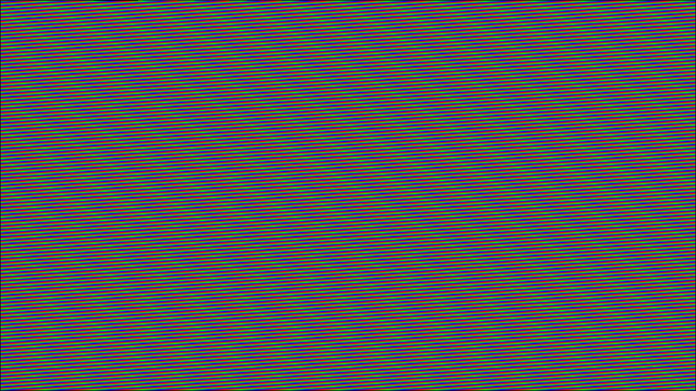

# Eclipse-10000 & 100000 Stack [WIP]
A complete computer system built from the ground up: from raw logic gates CPU and custom 32-bit SystemVerilog CPUs to an assembler, compiler, and relatively high-level programming language.

*Figure 1: The Eclipse-100000 running a rainbow renderer program, obviously written in my language (`render.flar`) at 23MHz / 60FPS.*

> **Deep Dive Documentation:**
> Detailed technical specifications, diagrams, and architectural decisions of all project are documented in [`Eclipse_10000.pdf`](./Eclipse_10000.pdf), I recommend reading it first. Language documentation can be found in [`docs/flare.md`](./docs/flare.md).

Many of the CPU and Compiler files do not contain much of a comments, its because only when finishing compiler I realized how good comments are. This project is NOT vibecoded or anything like that, there is just no point of me doing that.

## Status & Roadmap

- [x] **16-Bit CPU:** Built in Logisim using logic gates (`ISA16.txt`)
- [x] **32-Bit CPU:** Built in SystemVerilog with a custom ISA (`ISA32.txt`)
- [/] **Compiler:** Custom programming language (FLARE-10K) compiling to assembler (In Progress(almost finished))
- [-] **Secret next phase**

---

# Eclipse-10000
Eclipse-10000 is a fully custom 16-bit multi-cycle CPU made in Logisim-evolution using exclusively logic gates and other lowest-level components. It has everything a basic CPU needs, and it can even run Fibonacci.

# Eclipse-100000
Eclipse-100000 (one more zero) is a 32-bit multi-cycle CPU as well, but it is much more advanced and written in SystemVerilog.

# FLARE-10K
FLARE-10K is a fully custom systems programming language/compiler.

---

# My Journey
Because I explained all the technical aspects in the paper, as well as how to use the language in the documentation, I feel like this is a good place to share my personal journey through this project. 

First of all, I had a lot of fun building all of this - so much fun that I was averaging about 8 hours of development per day. This importantly included debugging, especially troubleshooting my CPU in GTKWave and using memory stores as a sort of "print" statement for debugging. Now, I can proudly say that I really do know how computers work, because I actually built one.

## Eclipse-10000
I really liked building that CPU - assembling it block by block, circuit by circuit, connecting individual wires, coming up with solutions to problems, and researching how CPUs work under the hood. I truly enjoyed doing it.

## Eclipse-100000
Now this is the real CPU, theoretically capable of running an OS. For now, though, it can render a rainbow effect at 23MHz and 60FPS. This was a very fun project as well. It involved a lot of decision-making and had me inventing a lot of concepts from scratch (even though they might have already been invented, I just don't know about them).

I love fragmented shaders; they come into play in so many different ways. The same goes for SPRs - they save GPRs, because I firmly stand by the idea that GPRs are **General** Purpose and we shouldn't use them for anything else, even though I had to sacrifice rx30 and rx31. Also, writing an assembler turned out to be pretty interesting.

## FLARE-10K
That is the biggest part of the project so far. It involved a lot of research, including reading parts of *Crafting Interpreters* and *Engineering a Compiler* books, which was really fun.

When I first read about parsers, I was honestly confused and didn't understand much. However, after a lot of research, I understood how they work and realized the concept is actually pretty straightforward. Then, after actually coding one, I came to really love the parser - it flows just like a waterfall.

I also really like the codegen; hands down, it is the most complicated part of the compiler, which is exactly why I like it. The graph-coloring algorithm is beautiful, the code generation itself is beautiful, and overall the whole process is just very beautiful. There isn't much else to say about the other compiler parts, as they were somewhat easier to implement.

